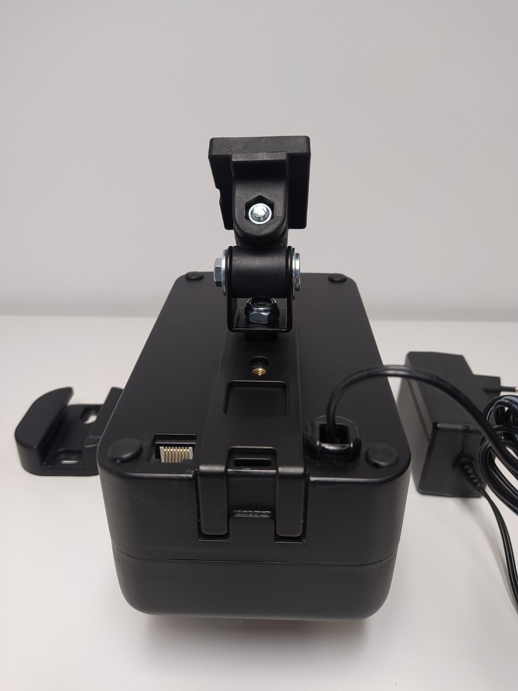
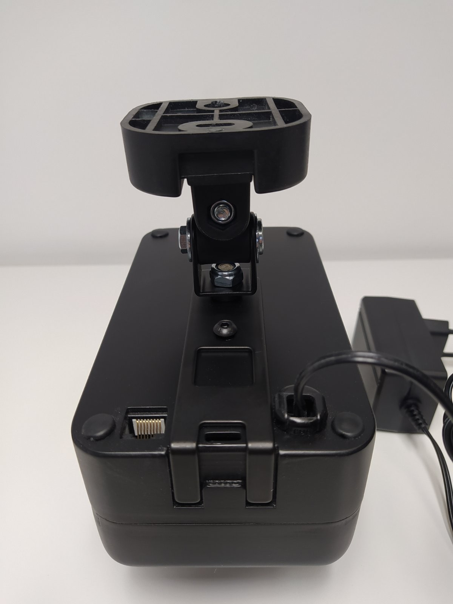
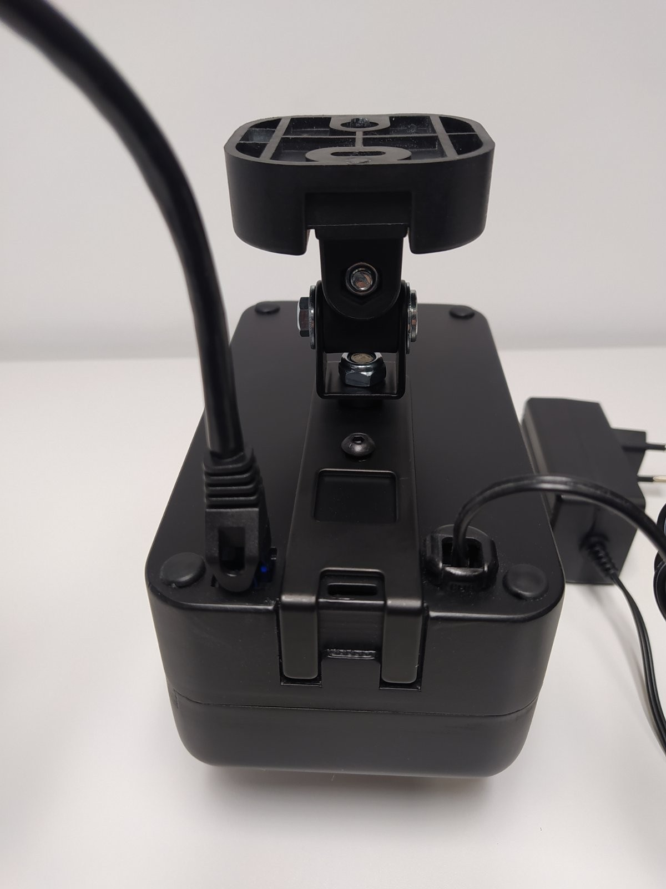
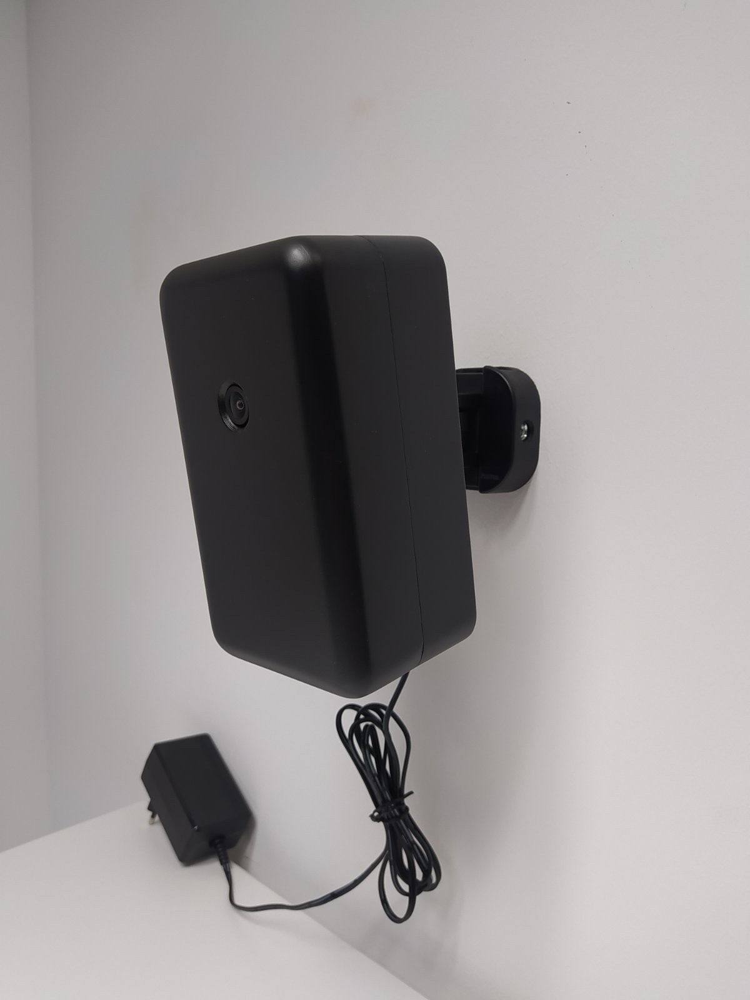

# Public installation and usage documentation for BAUTA's Drinnenbox

## Setting up the hardware

The "drinnebox" consists of two major components, the first one is BAUTA's special developed compact sensor unit and the second part is a nVidia Jetson-family on-premise small formfactor compute unit. The two components are connected together via a standard Cat5 ethernet cable through which the data stream from the sensor is submited through to the on-premise compute unit. On the on-premise compute unit the sensor stream is analyzed via a set of specifically trained deep neural networks.
When assembling / setting up the drinnenbox we recommend to start with the sensor unit first

### Setting up the sensor unit

The sensor-unit comes with the following parts (as depicted above):
 
 * The main sensor unit box
 * 5 meter long Ethernet Cat5 cabel
 * Two parts for wall mounting
   * A tilting bracket
   * A mounting plate on top of the tilting bracket
   * A M4 screw to attach the tilting bracket to the sensor unit box
 * A 5V/3A power supply unit

#### First step
Use the M4 scew to attach the tilting bracket to the sensor unit box

For this you need a size 3 allen key

#### Second step
Slide the mouning plate on top of the tilting bracket

#### Second step
Now connect on end of the Ethernet Cat5 cabel to the network part on the back of the sensor unit box

Now your the sensor unit is ready to be fixated onto the wall or ceiling the recommended operation height is between 2.5 to 3.5 meters above ground level. With a tilting angle between 20-45 degrees. Using it outside these specification will lead to serious performance degration in terms of object detection performance

### Setting up the on-premise compute unit

### Start-up sequence

### Quick verification if all is running

### Detail usages

### Notes
