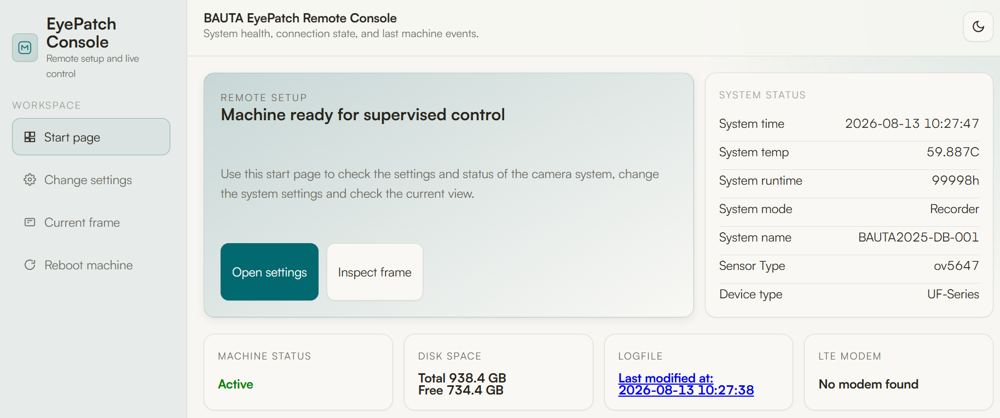
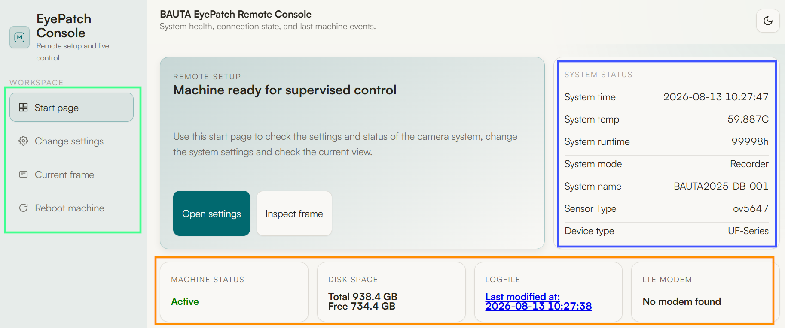

# Public documentation on BAUTA's blindsensors

## General information

## Manuals
[UF-Series](manuals/Betriebsanleitung-UF-Serie-BJ2026+.pdf)
[KB-Series](manuals/Betriebsanleitung-KB-Serie-BJ2026+.pdf)

## Documentation on the user frontend software 

## Documentation on the nVidia Jetson based detection system

# 关于 BAUTA 盲传感器的公开文档   

## 一般信息

一般 GDPR 规则
CCTV 最常见的合法依据是 合法利益，通常用于安全或财产保护，但仍需要进行 比例性评估，并且如果监控是大规模、系统性的，或结合了额外的分析（例如人脸识别或行为分析），通常还需要进行 DPIA（数据保护影响评估）。

你必须通过 清晰可见的标示 告知公众，并提供更详细的通知内容，包括：控制者信息、目的、法律依据、保存期限、接收方、安全措施以及投诉权利。

影像资料只能在必要的时间内保存，GDPR 并未设定统一的保存期限；通常由各国法规或监管机构的指导来决定。

对于智能摄像头，如果系统不仅是被动录制，而是进行 生物识别、自动画像分析或行为检测，风险等级会更高，因为这些功能可能触发更严格的 GDPR 要求，并且在某些国家法律下可能需要额外限制或事前授权。

成员国差异
GDPR 在整个欧盟直接适用，但成员国仍通过国家法律来影响摄像头的使用，尤其是在 公共空间、工作场所、保存期限、标示要求，以及某些“智能”功能是否需要额外批准等方面。

### Blindsensor 启动序列 

设备通电后大约需要 60 秒才能完全启动并开始发送图像。
确认 Blindsensor 正在运行并发送帧数据
在 Windows 8.1/10/11 上请下载该压缩包：

```
Blindsensor_status_check.zip
```
使用标准以太网跳线将您的 Windows 电脑连接到 Blindsensor。

在您的 Windows 电脑上任意位置解压该压缩包，例如桌面。

首先运行批处理脚本：

```
setup_ethernetconfig_to_connect_to_blindsensor.bat 
```
通过双击来运行它（可能会请求权限，请允许）。该脚本会将您的以太网适配器配置到与 Blindsensor 相同的私有本地网络中。

现在打开您喜欢的网页浏览器，并访问以下地址:
```
http://10.0.0.15:8080 
```
这将打开 EyePatch 远程网页控制台。有关该网页控制台的更多信息，请参阅下方对应的章节。

## 手册

[UF-Series](manuals/Betriebsanleitung-UF-Serie-BJ2026+.pdf)
[KB-Series](manuals/Betriebsanleitung-KB-Serie-BJ2026+.pdf)

## 用户前端软件文档


开始页面

🟩 菜单栏 
更改设置
实时画面当前帧
重启机器

🟦 导入系统设置

🟨 系统状态

## 基于 nVidia Jetson 的检测系统文档
