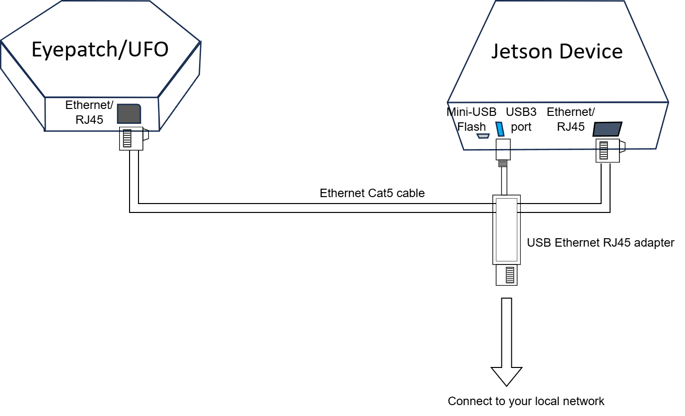
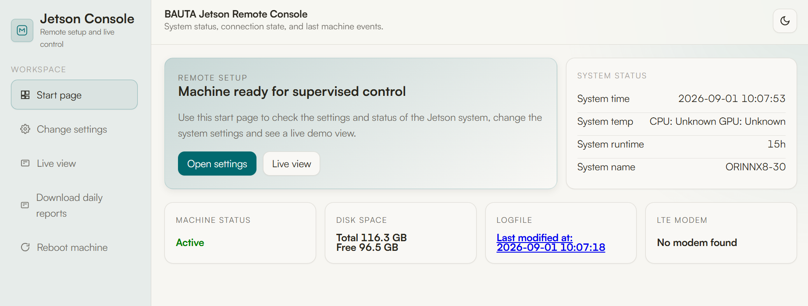

# Public documentation on BAUTA's blindsensors

## General information

## Manuals
[UF-Series German](manuals/Betriebsanleitung-UF-Serie-BJ2026+.pdf)
[UF-Series English](manuals/Operatingmanual-UF-Serie-BJ2026+.pdf)
[KB-Series German](manuals/Betriebsanleitung-KB-Serie-BJ2026+.pdf) 
[KB-Series English](manuals/Operatingmanual-KB-Serie-BJ2026+.pdf) 

## Documentation on the user frontend software 

## Documentation on the nVidia Jetson based detection system
Here is an illustration on how to connect the Eyepatch system with the nVidia Jetson analysis system. In this illustrated scenario we have a nVidia Jetson ORIN device that has only a single Ethernet port. This means in order to access the nVidia Jetson device while it is connected to the EyePatch system you need an additional USB-Ethernet-Adapter to be able and plug it into your local network. Otherwise you can not access the nVidia Jetson system operating console. In its normal operation mode this USB port is occupied by an USB LTE cellular network modem stick. 



The ethernet port of the nVidia Jetson system is pre-configured to be in the same fixed subnet than the EyePatch. Unless you have changed the IP settings of the EyePatch system no further configuration is required. 

Notice after turning on the nVidia Jetson startup sequence takes a while before the detection process is started and therefore it connects to the EyePatch systems as it first does some internal housekeeping tasks, e.g. checking for new software updates and sending off reports. Usually this is done via the LTE cellular network modem stick, which mean it can take up to 10 minutes (if no carrier signal can be found). However the nVidia Jetson web console can be accessed already roughly 30 seconds after switching on.

To access the web console you need to know which IP the device has been assigned to then use your favourite web browser on a device that is in the same subnet as the Jetson device, and go to:

```
http://IP_OF_JETSON_DEVICE:8080 
```

You should see a screen like this


# BAUTA의 블라인드센서에 대한 공개 문서   

## 총괄 정보

일반적인 GDPR 규정에 따르면, CCTV 운영의 가장 흔한 적법한 근거는 ‘정당한 이익’이며, 이는 주로 보안 또는 재산 보호 목적에 사용됩니다. 그러나 비례성 평가가 여전히 필요하며, 모니터링이 대규모이거나 체계적이거나 얼굴 인식·행동 분석과 같은 추가적인 분석이 결합되는 경우에는 일반적으로 DPIA(데이터 보호 영향 평가)를 수행해야 합니다.
공개적으로 잘 보이는 안내 표지를 통해 사람들에게 정보를 제공해야 하며, 다음과 같은 내용을 포함한 보다 상세한 고지를 제공해야 합니다: 개인정보 처리자 정보, 처리 목적, 법적 근거, 보관 기간, 제공받는 자, 보안 조치, 그리고 불만 제기 권리.
영상 자료는 필요한 기간 동안만 보관할 수 있습니다. GDPR은 일률적인 보관 기간을 정해두지 않으며, 보관 기간은 일반적으로 각 국가의 법률이나 규제 지침에 따라 결정됩니다.

스마트 카메라의 경우, 단순한 영상 기록을 넘어 생체정보 식별, 자동 프로파일링, 행동 감지 등의 기능을 수행한다면 위험 수준이 더 높아집니다. 이러한 기능은 더 엄격한 GDPR 요건을 촉발할 수 있으며, 일부 국가 법률에서는 추가적인 제한이나 사전 승인 절차가 요구될 수 있습니다.

회원국별 차이점:
GDPR은 EU 전역에 직접 적용되지만, 각 회원국은 공공장소, 직장, 보관 기간, 안내 표지 요건, 그리고 특정 ‘스마트’ 기능에 추가 승인 여부가 필요한지 등과 관련하여 자국 법률을 통해 카메라 사용 방식에 여전히 영향을 미칩니다.

### 블라인드센서 설정하기

시동 절차

전원이 공급된 후 장치가 완전히 동작하여 이미지를 전송하기까지 약 60초가 걸립니다.

Windows 8.1/10/11용 아카이브를 다운로드하십시오:

```
Blindsensor_status_check.zip
```
1. 표준 이더넷 패치 케이블을 사용하여 Windows 컴퓨터를 블라인드센서에 연결합니다.
2. 아카이브를 Windows 컴퓨터의 아무 위치(예: 바탕화면)에 압축 해제합니다.
3. 먼저 배치 스크립트를 실행합니다.
```
setup_ethernetconfig_to_connect_to_blindsensor.bat 
```
通过双击来运行它（可能会请求权限，请允许）。该脚本会将您的以太网适配器配置到与 Blindsensor 相同的私有本地网络中。

더블 클릭하여 실행합니다(권한 요청이 나타날 수 있으며, 허용해 주십시오).
이 스크립트는 사용자의 이더넷 어댑터를 블라인드센서와 동일한 사설 로컬 네트워크로 설정합니다.

이제 Windows 컴퓨터에서 웹 브라우저를 열고 다음 URL을 입력하십시오.:
```
http://10.0.0.15:8080 
```
이렇게 하면 EyePatch 웹콘솔이 열립니다.
EyePatch 웹콘솔에 대한 자세한 정보는 아래 섹션을 참고하십시오.

## 기술 매뉴얼

[UF-Series German](manuals/Betriebsanleitung-UF-Serie-BJ2026+.pdf)
[UF-Series English](manuals/Operatingmanual-UF-Serie-BJ2026+.pdf)
[KB-Series German](manuals/Betriebsanleitung-KB-Serie-BJ2026+.pdf) 
[KB-Series English](manuals/Operatingmanual-KB-Serie-BJ2026+.pdf) 


## 사용자 프런트엔드 소프트웨어에 대한 문서


开始页面

🟩 菜单栏 
更改设置
实时画面当前帧
重启机器

🟦 导入系统设置

🟨 系统状态

## nVidia Jetson 기반 감지 시스템 문서화

这是一个示例，说明如何将 EyePatch 系统 与 NVIDIA Jetson 分析系统连接起来。
在此示例场景中，我们使用的是一台 NVIDIA Jetson ORIN 设备，它只有 一个以太网端口。
这意味着：当 Jetson 设备连接到 EyePatch 系统时，如果你仍然需要访问 Jetson 的操作控制台，就必须额外使用 USB‑以太网适配器 将其接入你的本地网络。否则，你将无法访问 NVIDIA Jetson 系统的操作界面。

在正常运行模式下，这个 USB 端口通常被 USB LTE 蜂窝网络调制解调器占用。


nVidia Jetson 系统的以太网端口已预先配置为与 EyePatch 处于同一个固定子网。  
只要你没有更改 EyePatch 系统的 IP 设置，就不需要进行任何额外的网络配置。

请注意：在开启 nVidia Jetson 后，它的启动流程需要一段时间，只有在完成内部的初始化任务后才会开始检测流程并连接到 EyePatch 系统。
这些内部任务包括：检查是否有新的软件更新、发送系统报告等。通常这些操作是通过 USB LTE 蜂窝网络调制解调器完成的。如果无法找到运营商信号，这些步骤可能会持续 最长约 10 分钟。

然而，nVidia Jetson 的 Web 控制台通常在开机约 30 秒后就可以访问，无需等待上述后台任务完成。

访问网页控制台之前，你需要先知道设备被分配到的 IP 地址。然后，在与 Jetson 设备处于同一子网的另一台设备上，使用你喜欢的网页浏览器，打开以下地址：
```
http://IP_OF_JETSON_DEVICE:8080 
```
你应该会看到一个类似这样的界面

