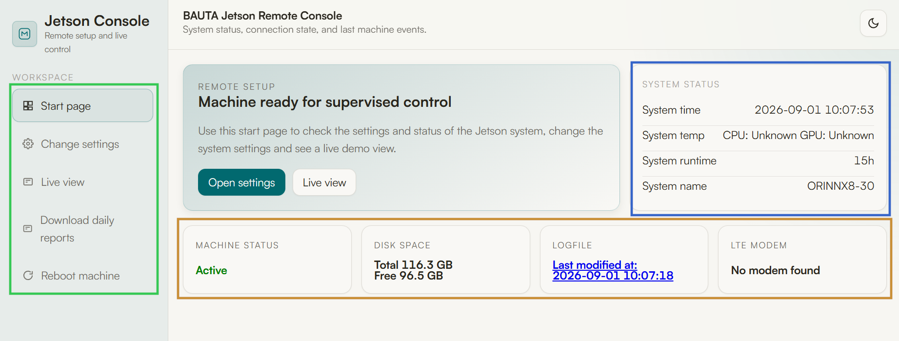
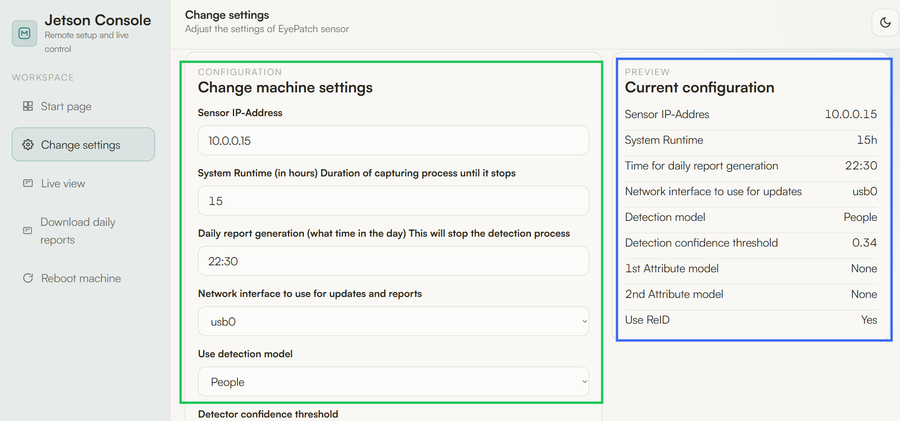

# Public documentation on BAUTA's blindsensors

## General information

## Manuals
[UF-Series German](manuals/Betriebsanleitung-UF-Serie-BJ2026+.pdf)
[UF-Series English](manuals/Operatingmanual-UF-Serie-BJ2026+.pdf)
[KB-Series German](manuals/Betriebsanleitung-KB-Serie-BJ2026+.pdf) 
[KB-Series English](manuals/Operatingmanual-KB-Serie-BJ2026+.pdf) 

## Documentation on the user frontend software 

## Documentation on the nVidia Jetson based detection system
Here is an illustration on how to connect the Eyepatch system with the nVidia Jetson analysis system. In this illustrated scenario we have a nVidia Jetson ORIN device that has only a single Ethernet port. This means in order to access the nVidia Jetson device while it is connected to the EyePatch system you need an additional USB-Ethernet-Adapter to be able and plug it into your local network. Otherwise you can not access the nVidia Jetson system operating console. In its normal operation mode this USB port is occupied by an USB LTE cellular network modem stick. 


The ethernet port of the nVidia Jetson system is pre-configured to be in the same fixed subnet than the EyePatch. Unless you have changed the IP settings of the EyePatch system no further configuration is required. 

Notice after turning on the nVidia Jetson startup sequence takes a while before the detection process is started and therefore it connects to the EyePatch systems as it first does some internal housekeeping tasks, e.g. checking for new software updates and sending off reports. Usually this is done via the LTE cellular network modem stick, which mean it can take up to 10 minutes (if no carrier signal can be found). However the nVidia Jetson web console can be accessed already roughly 30 seconds after switching on.

To access the web console you need to know which IP the device has been assigned to then use your favourite web browser on a device that is in the same subnet as the Jetson device, and go to:

```
http://IP_OF_JETSON_DEVICE:8080 
```

You should see a screen like this


Short explanation of the web console main page



🟩 Main menu bar available on every page

🟦 Main system status overview

🟨 Current important system status and metrics

# BAUTA의 블라인드센서에 대한 공개 문서   

## 총괄 정보

일반적인 GDPR 규정에 따르면, CCTV 운영의 가장 흔한 적법한 근거는 ‘정당한 이익’이며, 이는 주로 보안 또는 재산 보호 목적에 사용됩니다. 그러나 비례성 평가가 여전히 필요하며, 모니터링이 대규모이거나 체계적이거나 얼굴 인식·행동 분석과 같은 추가적인 분석이 결합되는 경우에는 일반적으로 DPIA(데이터 보호 영향 평가)를 수행해야 합니다.
공개적으로 잘 보이는 안내 표지를 통해 사람들에게 정보를 제공해야 하며, 다음과 같은 내용을 포함한 보다 상세한 고지를 제공해야 합니다: 개인정보 처리자 정보, 처리 목적, 법적 근거, 보관 기간, 제공받는 자, 보안 조치, 그리고 불만 제기 권리.
영상 자료는 필요한 기간 동안만 보관할 수 있습니다. GDPR은 일률적인 보관 기간을 정해두지 않으며, 보관 기간은 일반적으로 각 국가의 법률이나 규제 지침에 따라 결정됩니다.

스마트 카메라의 경우, 단순한 영상 기록을 넘어 생체정보 식별, 자동 프로파일링, 행동 감지 등의 기능을 수행한다면 위험 수준이 더 높아집니다. 이러한 기능은 더 엄격한 GDPR 요건을 촉발할 수 있으며, 일부 국가 법률에서는 추가적인 제한이나 사전 승인 절차가 요구될 수 있습니다.

회원국별 차이점:
GDPR은 EU 전역에 직접 적용되지만, 각 회원국은 공공장소, 직장, 보관 기간, 안내 표지 요건, 그리고 특정 ‘스마트’ 기능에 추가 승인 여부가 필요한지 등과 관련하여 자국 법률을 통해 카메라 사용 방식에 여전히 영향을 미칩니다.

### 블라인드센서 설정하기

시동 절차

전원이 공급된 후 장치가 완전히 동작하여 이미지를 전송하기까지 약 60초가 걸립니다.

Windows 8.1/10/11용 아카이브를 다운로드하십시오:

```
Blindsensor_status_check.zip
```
1. 표준 이더넷 패치 케이블을 사용하여 Windows 컴퓨터를 블라인드센서에 연결합니다.
2. 아카이브를 Windows 컴퓨터의 아무 위치(예: 바탕화면)에 압축 해제합니다.
3. 먼저 배치 스크립트를 실행합니다.
```
setup_ethernetconfig_to_connect_to_blindsensor.bat 
```
通过双击来运行它（可能会请求权限，请允许）。该脚本会将您的以太网适配器配置到与 Blindsensor 相同的私有本地网络中。

더블 클릭하여 실행합니다(권한 요청이 나타날 수 있으며, 허용해 주십시오).
이 스크립트는 사용자의 이더넷 어댑터를 블라인드센서와 동일한 사설 로컬 네트워크로 설정합니다.

이제 Windows 컴퓨터에서 웹 브라우저를 열고 다음 URL을 입력하십시오.:
```
http://10.0.0.15:8080 
```
이렇게 하면 EyePatch 웹콘솔이 열립니다.
EyePatch 웹콘솔에 대한 자세한 정보는 아래 섹션을 참고하십시오.

## 기술 매뉴얼

[UF-Series German](manuals/Betriebsanleitung-UF-Serie-BJ2026+.pdf)
[UF-Series English](manuals/Operatingmanual-UF-Serie-BJ2026+.pdf)
[KB-Series German](manuals/Betriebsanleitung-KB-Serie-BJ2026+.pdf) 
[KB-Series English](manuals/Operatingmanual-KB-Serie-BJ2026+.pdf) 


## 사용자 프런트엔드 소프트웨어에 대한 문서


开始页面

🟩 菜单栏 
更改设置
实时画面当前帧
重启机器

🟦 导入系统设置

🟨 系统状态

## nVidia Jetson 기반 감지 시스템 문서화

다음은 EyePatch 시스템을 nVidia Jetson 분석 시스템과 연결하는 방법을 보여주는 예시입니다.
이 예시에서는 이더넷 포트가 하나만 있는 nVidia Jetson ORIN 장치를 사용하고 있습니다.
이 경우 Jetson 장치가 EyePatch 시스템에 연결되어 있는 동안 Jetson 장치에 접근하려면 추가적인 USB‑이더넷 어댑터가 필요하며, 이를 통해 Jetson 장치를 로컬 네트워크에 연결할 수 있습니다.
그렇지 않으면 nVidia Jetson 시스템의 운영 콘솔에 접근할 수 없습니다.
일반적인 운영 모드에서는 이 USB 포트가 USB LTE 셀룰러 네트워크 모뎀 스틱으로 사용되고 있습니다.


nVidia Jetson 시스템의 이더넷 포트는 EyePatch와 동일한 고정 서브넷을 사용하도록 미리 설정되어 있습니다.

nVidia Jetson을 켠 후에는 감지 프로세스가 시작되기까지 시간이 걸립니다.
이는 Jetson이 EyePatch 시스템에 연결되기 전에 내부 정리 작업을 먼저 수행하기 때문이며, 예를 들어 새로운 소프트웨어 업데이트 확인이나 보고서 전송 등이 포함됩니다.
일반적으로 이러한 작업은 LTE 셀룰러 네트워크 모뎀 스틱을 통해 이루어지므로, 통신사 신호를 찾지 못하는 경우 최대 10분까지 걸릴 수 있습니다.
그러나 Jetson 웹 콘솔은 전원을 켠 후 약 30초 정도 지나면 이미 접근할 수 있습니다.

웹 콘솔에 접근하려면 먼저 Jetson 장치에 할당된 IP 주소를 알아야 합니다.
그 다음 Jetson 장치와 동일한 서브넷에 있는 장치에서 사용 중인 웹 브라우저를 열고 다음 주소로 이동하십시오.

```
http://IP_OF_JETSON_DEVICE:8080 
```
다음과 같은 화면이 표시됩니다

웹 콘솔 메인 페이지에 대한 간단한 설명  

🟩 전 페이지에 공통 적용되는 메인 메뉴 바 구성 요소 

🟦 주요 시스템 상태 개요

🟨 시스템의 주요 상태 정보와 핵심 메트릭의 현재값

Jetson 웹 콘솔 설정 페이지



🟦 현재 시스템 및 프로그램 설정 값을 참조용으로 표시합니다 

🟩 다양한 설정을 변경합니다:

Sensor IP-Address: EyePatch 센서가 연결된 네트워크 인터페이스의 IP 주소입니다. 기본 설정은 10.0.0.15이며, 센서 주소를 수동으로 변경했거나 네트워크 상에서 EyePatch를 소프트웨어로 에뮬레이션하지 않는 이상 이 값을 변경할 필요가 없습니다.

System Runtime: 에서 메인 감지 프로세스를 몇 시간 동안 실행할지를 지정합니다.

Daily report generation (Time in the day): 시스템이 실행된 시간 전체를 기준으로 하루 보고서를 생성합니다. 이때 감지 프로세스가 아직 실행 중이면 보고서 생성 과정에서 종료되며 자동으로 재시작되지 않습니다. 하루 보고서 생성에는 일반적으로 5–10분이 걸립니다. 전원 타이머를 사용한다면 보고서 생성 시간 이후 최소 15분 이상 전원이 유지되도록 설정해야 합니다.

업데이트와 보고서 전송에 사용할 네트워크 인터페이스: nVidia Jetson 장치에서 업데이트를 확인하고 일일 보고서를 전송하는 데 사용되는 네트워크 인터페이스입니다. 기본값은 usb0이며, 이는 보통 시스템에 연결된 LTE 모뎀의 인터페이스 이름입니다. 다른 네트워크 인터페이스가 존재하면 자동으로 드롭다운 목록에 표시됩니다

감지 모델 사용: 서로 다른 객체 클래스에 최적화된 여러 detection 모델 중에서 선택합니다  

감지 신뢰도 임계값: 객체 감지를 유효한 감지 이벤트로 받아들일 기준을 결정합니다. 임계값을 높이면 불확실한 감지가 제거되지만, 상황에 따라 정상 감지가 제외될 수 있습니다. 임계값이 너무 낮으면 모델이 비슷한 객체를 잘못 인식해 많은 오탐지를 허용하게 됩니다.

첫 번째 속성 모델: 다양한 속성 클래스 감지 모델 중에서 첫 번째 속성을 선택합니다. 현재 nVidia Jetson ORIN 시스템은 객체 감지 및 재식별 모델 외에 두 개의 추가 속성 모델만 사용할 수 있을 정도의 연산 능력을 갖고 있습니다.

두 번째 속성 모델: 다양한 속성 클래스 감지 모델 중에서 두 번째 속성을 선택합니다

재식별 사용: 감지 과정에서 재식별(ReIdentification) 모델을 사용할지 여부를 선택합니다
