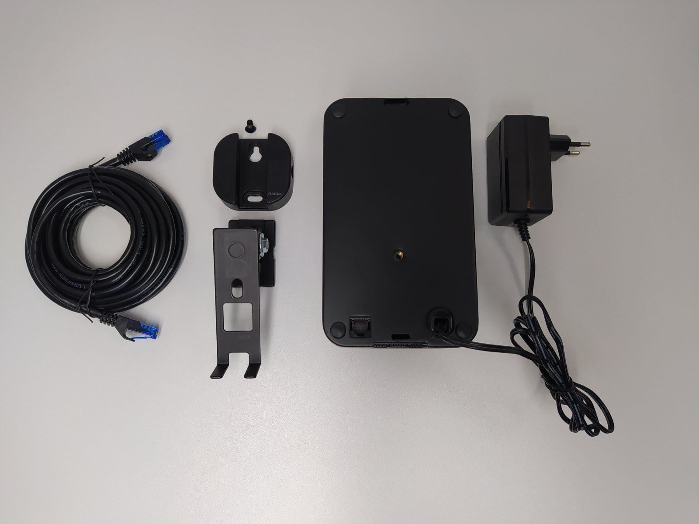

# Public installation and usage documentation for BAUTA's Drinnenbox
<p align="center"></p>

## Setting up the hardware

The "drinnebox" consists of two major components, the first one is BAUTA's special developed compact sensor unit and the second part is a nVidia Jetson-family on-premise small formfactor compute unit. The two components are connected together via a standard Cat5 ethernet cable through which the data stream from the sensor is submited through to the on-premise compute unit. On the on-premise compute unit the sensor stream is analyzed via a set of specifically trained deep neural networks.
When assembling / setting up the drinnenbox we recommend to start with the sensor unit first

### Setting up the sensor unit

<p align="center"></p>
The sensor-unit comes with the following parts (as depicted above):
 
 * The main sensor unit box
 * 5 meter long Ethernet Cat5 cabel
 * Two parts for wall mounting
   * A tilting bracket
   * A mounting plate on top of the tilting bracket
   * A M4 screw to attach the tilting bracket to the sensor unit box
 * A 5V/3A power supply unit

#### First step
Use the M4 scew to attach the tilting bracket to the sensor unit box

<p align="center"></p>

For this you need a size 3 allen key

#### Second step
Slide the mouning plate on top of the tilting bracket

<p align="center"></p>

#### Second step
Now connect on end of the Ethernet Cat5 cabel to the network part on the back of the sensor unit box

<p align="center"></p>

Now your the sensor unit is ready to be fixated onto the wall or ceiling the recommended operation height is between 2.5 to 3.5 meters above ground level. With a tilting angle between 20-45 degrees. Using it outside these specification will lead to serious performance degration in terms of object detection performance

<p align="center"></p>

### Setting up the on-premise compute unit
The on-premise compute unit does not come with any additional parts that need to be mounted. Out of the box it will look like this

<p align="center"></p>

However before connecting it to power or use one of the two ethernet cable connectors you can see in the picture it is crucial that you connect the etnerhet cable from the blndsensor in the network port as shown in the picture

<p align="center"></p>

The reason is that the on-premise unit has two netwoek adapters one that is configured to a fixed private network address to be able to communicate with the sensor unit and the other one is set to dynamic/DHCP so you can connect it to your network. The hardware address (MAC) for the dynamic network connector should have been provided as a label in the box. This will allow you to discover it in your network.

### Start-up sequence

The easiest solution is to have both power supplies of the sensor unit and the compute unit in a double or multi-socket wall power socket. If that is not feasible than the recommended start/power up sequence is to first provide power to the sensor unit by plug-in its power supply to the wall socket. It takes about 40 seconds for the sensor unit to become fully operational. Next would then be to plug-in the power supply of the compute unit to the wall socket. Please make sure that the compute unit's empty network connector has been connected to your network before you plug it in. The compute unit takes usually 1 minute before it starts receiving data from the sensor unit. However, at each startup sequence the compute unit is looking for new software updates which when found will install new updates automatically this can extend he waiting period significantly. The data service that can be used to querry the compute unit for latest data and sequence usually takes two minutes to become active. This means if you do not see the unit responding immediately after switching on to not worry wait about five minutes to try again.

### Quick verification if all is running

After 2-3 minutes after switching both units on in the order suggested above. You can check if everything is running. For this you need to find out to which IP address your network manager has assigned the compute unit to. Once you obtained this IP address you can than use a web browser on a machine that is in the same subnet of the compute unit and enter following address
```
http://IP_ADDRESS_OF_COMPUTE_UNIT:8080/getstatus
```
The browser should then return you a JSON String showing you the different system temperatures and also a field SystemRunning. If SystemRunning is False but it is still displaying temperatures that means that the part receiving and analysing the data stream is not running. The most likely reason for this is that it was unable to connect to the sensor unit. It will automically try to do so every 5 seconds. So please make sure the network cable from the sensor unit is plugged into the right network port of the compute unit (see picture above). 
Once you have confirmed that everything is up and running you can get a visual snapshot from the sensor view using the web broweser again by using following address
```
http://IP_ADDRESS_OF_COMPUTE_UNIT:8080/getsnapshot
```
You can also use this snapshot functionality to visually allign the sensor unit to cover the area you are interested in to observe.

### Detail usages

Once you have the system running, verified it is running and alligned the sensor to cover the area you are interested in you can start using to extract data. For this we included some example python scripts to illustrate the usage of the REST API that runs on the compute unite. See [examples](https://) for more detail

### Notes
In this section we describe some general notes about the drinnenbox sensor and a few troubleshoot suggestions.

#### General system notes
1. As previous mentioned the system checks for software updates at every startup so please make sure the network connection has the ability to comunicate to outside. Both port 8080 and 80 is used for getting updates.
2. After each restart of the compute unit previous sequence data gets deleted. So you can not look back beyond data that has been recorded prior the restart sequence
3. The compute unit automatically restarts after 20 hours of running. The compute unit has limited storage space this is to prevent the system to run out of space
4. Requesting sequence data always goes backwards from the current time you request
5. It is recommended to request sequence data in reasonable short time sequences. Although the system does not prevent you to look back multiple hours but this might lead into a very long response time
6. At the fist startup it could be that it restarts immediately because once it has been off the internet the internal system clock might have reseted and once the system starts to sync with nntp the date and time move beyond the 20 hours range
  
#### Troubleshoots
1. In case it takes very long to obtain a snapshot via the getsnapshot API call it could be that either the data receiving and detector part on the compute unit has ran into some issue and is hanging in this case you can try to use
```
http://IP_ADDRESS_OF_COMPUTE_UNIT:8080/restartdetector
```
If this does not help repower the sensor unit

2. In case you get a complete black screenshot back from the getnsaphot API. Repower the sensor unit. If the problem keeps on persisting after power-cycling than please get in contact with us
   
   
